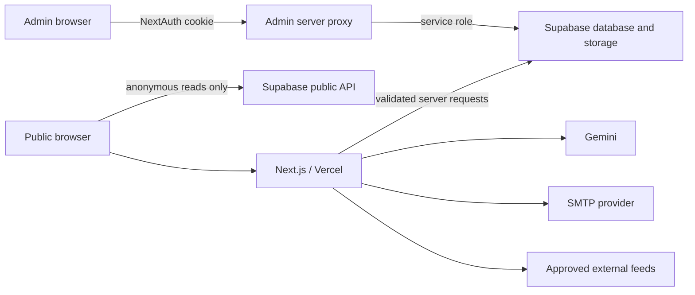

# Architecture

## System Overview

UseStack is a Next.js App Router application deployed on Vercel with Supabase for PostgreSQL and object storage. NextAuth provides application sessions. Gemini supports assisted extraction and workflow generation.

## Boundaries

### Public client

`lib/supabase.js` uses the publishable Supabase key. It is for catalog reads and narrowly approved public inserts such as submissions. Supabase Row Level Security is the final authorization boundary.

### Admin client

`lib/admin-supabase.js` preserves the Supabase query API for admin screens but sends table operations to `/api/admin/supabase`. The server verifies the NextAuth role, rechecks that role in the database, validates the request origin, then forwards only allowlisted table operations with the service role. Image uploads use `/api/admin/storage` with bucket, type, path, and size restrictions.

### Server integrations

- `lib/server/supabase-admin.js`: lazy service-role client
- `lib/server/supabase-public.js`: server-side publishable client
- `lib/server/mailer.js`: environment-configured SMTP transport
- `lib/server/rate-limit.js`: best-effort per-instance request limiting
- `lib/security.mjs`: URL, SSRF, input, HTML, and token helpers

## Authentication and Authorization

- NextAuth uses JWT sessions.
- Credentials are checked against bcrypt hashes in the `users` table.
- `/admin/*` is protected by middleware.
- Admin APIs repeat the role check; route protection is never treated as database authorization.
- External agent APIs require an exact bearer token and use server-only credentials.

## Data Domains

- Catalog: `products`, `companies`, `categories`, `sub_categories`, `tags`, junction tables
- Community: `submissions`, `reports`, `waitlist`
- Content: `blogs`, `stacks`, `product_stack_jnc`, `workflows`
- Commercial: `ads`, `company_ads`, `label_thumbnails`
- Identity: `users`

## Current Technical Debt

- Several admin screens remain large client components and should be split by query, form, and presentation responsibility.
- Rate limiting is process-local; production abuse protection should move to a shared store such as Vercel KV/Redis.
- Database schema and RLS migrations are not yet versioned in this repository. This is the next infrastructure priority.
- Public pages still perform many Supabase reads in the browser. Server rendering and caching should be introduced route by route.
